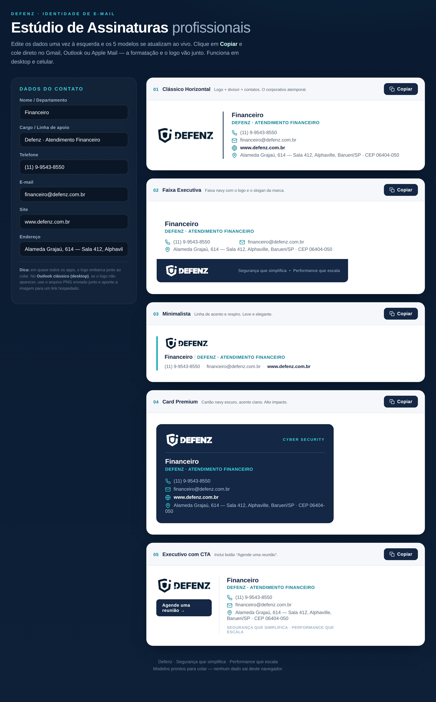

# Defenz · Estúdio de Assinaturas

Gerador de assinaturas de e-mail profissionais da **Defenz**, com a identidade visual da marca. Edite os dados uma vez e copie a assinatura formatada direto para o Gmail, Outlook ou Apple Mail — funciona em desktop e celular.

## ✨ O que faz

- **5 modelos profissionais** prontos para uso:
  1. **Clássico Horizontal** — logo, divisor e contatos. O corporativo atemporal.
  2. **Faixa Executiva** — faixa navy com logo e o slogan da marca.
  3. **Minimalista** — linha de acento e respiro, leve e elegante.
  4. **Card Premium** — cartão navy escuro, alto impacto.
  5. **Executivo com CTA** — inclui botão *"Agende uma reunião"*.
- **Edição ao vivo** — altere nome, cargo, telefone, e-mail e endereço uma vez; os 5 modelos se atualizam na hora.
- **Copiar e colar** — o botão copia o HTML já formatado, com o logo embarcado, pronto para o campo de assinatura.
- **Multiplataforma** — código de e-mail real (tabelas + estilo inline), nítido em qualquer dispositivo.

## 🎨 Identidade da marca

| Elemento | Valor |
|---|---|
| Navy principal | `#142744` |
| Navy profundo | `#0A1A30` |
| Acento ciano | `#14A8BE` |
| Slogan | *Segurança que simplifica · Performance que escala* |

O logo (versões navy e branca) está em [`assets/`](assets/).

## 🚀 Como usar

1. Abra o site publicado (GitHub Pages) ou o arquivo `index.html` no navegador.
2. Preencha os dados do contato no painel à esquerda.
3. Escolha um modelo e clique em **Copiar**.
4. Cole no campo de assinatura do seu e-mail.

> **Outlook clássico (desktop):** se o logo embutido for bloqueado, hospede os PNGs em [`assets/`](assets/) e aponte a imagem para o link.

## 🛠️ Tecnologia

HTML, CSS e JavaScript puros — sem dependências, sem build. Tudo roda no navegador; nenhum dado de contato sai do dispositivo.

## 📄 Licença

© 2026 Defenz. Todos os direitos reservados. O logo e a identidade visual são propriedade da Defenz.
